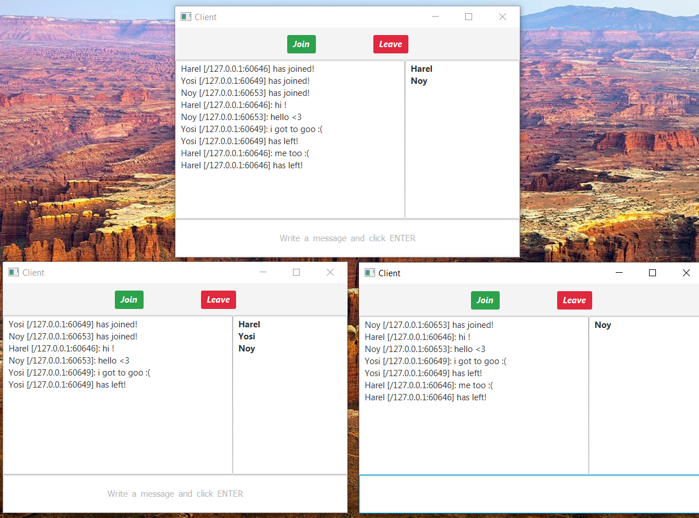

# JavaFX_Small_Projects
Several small, but nice java projects with UI using javaFX.

**Calendar:**
By definition of a constant in the code, allows you to select a specific number of years.
You select a year and a month and it shows you all the days according to their day of the week, in a pleasant monthly display.
You click on one of the days and add notes \ tasks \ meetings.
You can go a year and a month and everything will be preserved in the original date.
If you return to it and click on it, it will display what you wrote and you can edit it, of course.

**Conways_Game_of_Life:**
Conway the mathematician's game of life.
The game works according to certain rules, for example, if there are 3 live cells next to a live cell, the cell will continue to live.
If there is only one living cell near him, he will die of loneliness, and so on.. Click Next and see the change over the generations.

**Hangman:**
Nice and graphic hanging man game. The word is randomly selected from a pool.

**Trivia:**
American trivia game with 4 answer choices, where only one is correct.
If you are right you earn 10 points.
If you are wrong you lose 5 points.
At the end of the game you see how many points are left. You can stop the game whenever you want.

**Client-server (chat room):**
There is a computer (in this case a local one) that acts as a server.
You can run multiple UI's at the same time - these are essentially the gateways to the chat room.
To enter the room, you need to enter the server address and your name.
The server notifies all participants in the room when someone has joined or left.
Also, each message is broadcast to everyone.
The program uses both TCP networking and parallel programming (Threads).

